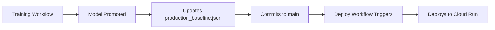

# Cloud Run Deployment Guide

This guide explains how to deploy the Rental Prediction API to Google Cloud Run using GitHub Actions.

## Prerequisites

✅ You've already completed:
- [x] Created GCP service account (`hy-408@fleet-anagram-244304.iam.gserviceaccount.com`)
- [x] Downloaded JSON key
- [x] Added key to GitHub Secrets as `GCP_SA_KEY`

## Deployment Architecture

```
GitHub Actions → Build Docker Image → Push to Artifact Registry → Deploy to Cloud Run
```

**What gets deployed:**
- FastAPI application (`src/rental_prediction/api/`)
- Production model baseline (`registry/production_baseline.json`)
- Trained models (`models/` directory)
- Training data (`data/` for validation)

## How to Deploy

### Option 1: Manual Deployment (Recommended for first deployment)

1. **Go to GitHub Actions**
   - Navigate to your repository
   - Click **Actions** tab
   - Select **"Deploy to Cloud Run"** workflow

2. **Trigger deployment**
   - Click **"Run workflow"**
   - Select environment: `production` or `staging`
   - Click **"Run workflow"** button

3. **Monitor deployment**
   - Watch the workflow progress
   - Review deployment summary when complete
   - Get your service URL from the summary

### Option 2: Automatic Deployment

Deployment automatically triggers when:
- A new model is promoted to production (changes to `registry/production_baseline.json` on `main` branch)

**Workflow:**


## Deployment Steps (Automated)

The workflow performs these steps:

1. **Authenticate to GCP** using your service account JSON key
2. **Create Artifact Registry** repository (if it doesn't exist)
3. **Build Docker image** with your API and models
4. **Push image** to Artifact Registry
5. **Deploy to Cloud Run** with configuration:
   - Memory: 2GB
   - CPU: 2 cores
   - Min instances: 0 (scales to zero when idle)
   - Max instances: 10
   - Timeout: 300 seconds
   - Public access: Allowed (unauthenticated)
6. **Test deployment** via health endpoint
7. **Report service URL** in workflow summary

## Configuration

### Environment Variables

Edit [`.github/workflows/deploy.yml`](.github/workflows/deploy.yml) to customize:

```yaml
env:
  PROJECT_ID: fleet-anagram-244304  # Your GCP project ID
  REGION: us-central1               # Deployment region
  SERVICE_NAME: rental-prediction-api
  IMAGE_NAME: rental-prediction-api
```

### Resource Configuration

Adjust Cloud Run resources in the deploy step:

```yaml
--memory 2Gi          # Increase if models are large
--cpu 2               # Increase for better performance
--min-instances 0     # Set > 0 to avoid cold starts
--max-instances 10    # Increase for high traffic
--timeout 300         # Max request duration (seconds)
```

### Cost Optimization

**Current configuration:**
- **Min instances: 0** - Scales to zero when idle (no cost)
- **2 vCPU, 2GB RAM** - Reasonable for ML inference
- **Estimated cost:** ~$0.024/hour when running, $0 when idle

**To reduce cold starts (increases cost):**
```yaml
--min-instances 1     # Always keep 1 instance running
```
**Cost:** ~$50-60/month for 1 always-on instance

## After Deployment

### Get Your API URL

After successful deployment, find your URL in:
1. **GitHub Actions summary** (workflow output)
2. **GCP Console:** Cloud Run → Services → rental-prediction-api
3. **CLI:** `gcloud run services describe rental-prediction-api --region us-central1 --format 'value(status.url)'`

Example URL: `https://rental-prediction-api-xxxxxxxxxx-uc.a.run.app`

### Test Your API

```bash
# Set your service URL
export API_URL="https://rental-prediction-api-xxxxxxxxxx-uc.a.run.app"

# Health check
curl $API_URL/health

# API documentation (open in browser)
open $API_URL/docs

# Make a prediction
curl -X POST "$API_URL/predict" \
  -H "Content-Type: application/json" \
  -d '{
    "features": {
      "area": 85.5,
      "rooms": 3,
      "construction_year": 2010,
      "balcony": "yes",
      "parking": "yes",
      "furnished": "no",
      "garage": "no",
      "storage": "yes",
      "garden": "50 m²"
    }
  }'
```

**Expected response:**
```json
{
  "predicted_rent": 1250.50,
  "model_name": "xgboost",
  "model_version": "20240106_020000"
}
```

### View Logs

```bash
# Stream logs
gcloud run services logs tail rental-prediction-api --region us-central1

# View logs in GCP Console
# Cloud Run → Services → rental-prediction-api → Logs
```

## Security Configuration

### Making API Private (Authenticated Access Only)

By default, the API allows unauthenticated access. To require authentication:

1. **Update deploy.yml:**
   ```yaml
   # Change this line:
   --allow-unauthenticated \

   # To:
   --no-allow-unauthenticated \
   ```

2. **Access the API with authentication:**
   ```bash
   # Get auth token
   TOKEN=$(gcloud auth print-identity-token)

   # Make authenticated request
   curl -H "Authorization: Bearer $TOKEN" $API_URL/health
   ```

### Restrict CORS Origins

For production, update [`src/rental_prediction/api/main.py`](../../src/rental_prediction/api/main.py):

```python
app.add_middleware(
    CORSMiddleware,
    # Change from:
    allow_origins=["*"],

    # To specific domains:
    allow_origins=[
        "https://yourdomain.com",
        "https://app.yourdomain.com"
    ],
    # ... rest of config
)
```

## Continuous Deployment Workflow

```
┌─────────────────────────────────────────────────────────────┐
│ 1. Code Push / Scheduled Run                                │
│    └─> Triggers Training Workflow                           │
└────────────────┬────────────────────────────────────────────┘
                 │
                 v
┌─────────────────────────────────────────────────────────────┐
│ 2. Training Workflow                                         │
│    ├─> Trains models with hyperparameter tuning             │
│    ├─> Compares new model vs production baseline            │
│    ├─> Promotes if RMSE improves                            │
│    └─> Commits production_baseline.json to main             │
└────────────────┬────────────────────────────────────────────┘
                 │
                 v (if promoted)
┌─────────────────────────────────────────────────────────────┐
│ 3. Deploy Workflow (Auto-triggered)                         │
│    ├─> Builds Docker image with new model                   │
│    ├─> Pushes to Artifact Registry                          │
│    ├─> Deploys to Cloud Run                                 │
│    └─> API now serves improved model                        │
└─────────────────────────────────────────────────────────────┘
```

## Troubleshooting

### Deployment fails with "Permission denied"

**Problem:** Service account lacks required permissions

**Solution:** Ensure service account has these roles:
- Cloud Run Admin (`roles/run.admin`)
- Service Account User (`roles/iam.serviceAccountUser`)
- Artifact Registry Writer (`roles/artifactregistry.writer`)

```bash
# Grant missing roles
SA_EMAIL="hy-408@fleet-anagram-244304.iam.gserviceaccount.com"

gcloud projects add-iam-policy-binding fleet-anagram-244304 \
  --member="serviceAccount:${SA_EMAIL}" \
  --role="roles/run.admin"
```

### Image build fails

**Problem:** Dependencies or code issues

**Solution:**
1. Test Docker build locally first:
   ```bash
   docker build -t test-api .
   docker run -p 8000:8000 test-api
   ```
2. Check workflow logs for specific errors

### Service is unhealthy after deployment

**Problem:** API failing to start or load model

**Solution:**
1. Check Cloud Run logs:
   ```bash
   gcloud run services logs read rental-prediction-api --region us-central1 --limit 50
   ```
2. Verify `registry/production_baseline.json` exists and is valid
3. Check if model files exist in `models/` directory

### Cold start is too slow

**Problem:** First request after idle takes too long

**Solutions:**
- Increase memory/CPU (faster cold starts)
- Set `--min-instances 1` (no cold starts, but costs more)
- Optimize Docker image size

### API returns 404 for all endpoints

**Problem:** Cloud Run routing issue

**Solution:** Verify port 8000 is exposed:
```yaml
--port 8000
```

## Monitoring & Observability

### Cloud Run Metrics

View in GCP Console (Cloud Run → Services → rental-prediction-api → Metrics):
- Request count
- Request latency (p50, p95, p99)
- Error rate
- Instance count
- CPU/Memory utilization

### Set Up Alerts

Create alerts for:
- Error rate > 5%
- p95 latency > 2 seconds
- Instance count hits max

### Custom Metrics

Add Cloud Monitoring:
```bash
# Install in pyproject.toml
google-cloud-monitoring
```

Log custom metrics from your API:
```python
from google.cloud import monitoring_v3
# Track prediction latency, model version, etc.
```

## Rollback

If deployment has issues, rollback to previous version:

```bash
# List revisions
gcloud run revisions list --service rental-prediction-api --region us-central1

# Rollback to previous revision
gcloud run services update-traffic rental-prediction-api \
  --region us-central1 \
  --to-revisions REVISION_NAME=100
```

## Advanced: Blue-Green Deployment

Deploy new version with traffic splitting:

```bash
# Deploy new version without traffic
gcloud run deploy rental-prediction-api-canary \
  --image $NEW_IMAGE \
  --no-traffic \
  --region us-central1

# Test canary
curl https://rental-prediction-api-canary-xxx.run.app/health

# Gradually shift traffic (10% → 50% → 100%)
gcloud run services update-traffic rental-prediction-api \
  --to-revisions LATEST=10,PREVIOUS=90 \
  --region us-central1
```

## Cost Estimation

**With current configuration (min-instances=0):**
- **Idle:** $0/month (scales to zero)
- **Active (1 req/sec avg):** ~$5-10/month
- **Active (10 req/sec avg):** ~$30-40/month

**With min-instances=1 (no cold starts):**
- **Base cost:** ~$50-60/month (always-on instance)
- **Additional traffic:** ~$0.024/hour per extra instance

**To monitor costs:**
- GCP Console → Billing → Reports
- Filter by "Cloud Run" service

## Next Steps

1. ✅ **Deploy manually** to verify setup
2. ✅ **Test all endpoints** with curl or Postman
3. ✅ **Monitor first requests** in Cloud Run logs
4. ⬜ **Set up monitoring alerts** for production
5. ⬜ **Configure custom domain** (optional)
6. ⬜ **Enable HTTPS redirect** (automatic with Cloud Run)
7. ⬜ **Restrict CORS** origins for security
8. ⬜ **Consider Cloud Armor** for DDoS protection

## Resources

- [Cloud Run Documentation](https://cloud.google.com/run/docs)
- [Cloud Run Pricing](https://cloud.google.com/run/pricing)
- [FastAPI Deployment Best Practices](https://fastapi.tiangolo.com/deployment/docker/)
- [GitHub Actions for GCP](https://github.com/google-github-actions)
