<!-- omit from toc -->
# ML in Production Examples

[](https://opensource.org/licenses/MIT)

A repository demonstrating various approaches and patterns for productionizing machine learning models, using a rental prediction toy example (more will be added in the future) with **automated continuous training via GitHub Actions**.

<!-- omit from toc -->
## Table of Contents

- [Features](#features)
- [Getting Started](#getting-started)
  - [Prerequisites](#prerequisites)
  - [Installation](#installation)
- [Quick Start](#quick-start)
  - [Local Training](#local-training)
  - [Model Serving (API)](#model-serving-api)
  - [Using GitHub Actions (Continuous Training)](#using-github-actions-continuous-training)
    - [1. Manual Training](#1-manual-training)
    - [2. Scheduled Training](#2-scheduled-training)
    - [3. Automatic Model Promotion](#3-automatic-model-promotion)
    - [4. Cloud Deployment](#4-cloud-deployment)
- [Project Structure](#project-structure)
- [MLOps Pipeline](#mlops-pipeline)
  - [CI/CD Workflow](#cicd-workflow)
  - [Continuous Training Pipeline](#continuous-training-pipeline)
- [Model Development](#model-development)
  - [Training a Model](#training-a-model)
  - [Hyperparameter Tuning](#hyperparameter-tuning)
- [Configuration](#configuration)
- [Architecture Decisions](#architecture-decisions)
  - [Data Loading: Protocol vs ABC](#data-loading-protocol-vs-abc)
  - [Configuration: Pydantic vs Dataclasses](#configuration-pydantic-vs-dataclasses)
  - [Preprocessing: Chain of Responsibility](#preprocessing-chain-of-responsibility)
- [API Reference](#api-reference)
  - [Running the API](#running-the-api)
    - [With Docker (Recommended)](#with-docker-recommended)
    - [Local Development](#local-development)
  - [API Endpoints](#api-endpoints)
    - [`GET /` - API Information](#get----api-information)
    - [`GET /health` - Health Check](#get-health---health-check)
    - [`POST /predict` - Single Prediction](#post-predict---single-prediction)
    - [`POST /predict/batch` - Batch Predictions](#post-predictbatch---batch-predictions)
    - [`GET /model/info` - Model Metadata](#get-modelinfo---model-metadata)
    - [`POST /model/reload` - Reload Model](#post-modelreload---reload-model)
  - [Interactive API Documentation](#interactive-api-documentation)
- [Monitoring \& Observability](#monitoring--observability)
  - [MLflow Tracking](#mlflow-tracking)
  - [GitHub Actions Dashboard](#github-actions-dashboard)
  - [Production Baseline](#production-baseline)
  - [API Monitoring](#api-monitoring)
- [Architecture \& Component Interactions](#architecture--component-interactions)
  - [Complete MLOps Pipeline Flow](#complete-mlops-pipeline-flow)
  - [Key Interactions](#key-interactions)
  - [Component Dependencies](#component-dependencies)
- [Customization](#customization)
  - [Change Training Schedule](#change-training-schedule)
  - [Adjust Promotion Criteria](#adjust-promotion-criteria)
  - [Add Cloud Storage](#add-cloud-storage)
- [Roadmap](#roadmap)
  - [Testing \& Quality Assurance (High Priority)](#testing--quality-assurance-high-priority)
  - [Production Monitoring (Future Enhancement)](#production-monitoring-future-enhancement)
  - [Other Future Enhancements](#other-future-enhancements)
- [AI-Assisted Development](#ai-assisted-development)
- [License](#license)

## Features

- 🏗️ **Production-ready architecture**: Modular design with data validation, preprocessing pipelines, and model registry
- 🚀 **REST API serving**: FastAPI application with automatic docs, validation, and Docker support
- ☁️ **Cloud deployment**: One-click deployment to Google Cloud Run with GitHub Actions
- 🤖 **Automated CI/CD**: GitHub Actions for testing, training, model promotion, and deployment
- 📊 **Experiment tracking**: MLflow integration for comprehensive experiment logging
- 🔄 **Continuous training**: Scheduled retraining with automatic model promotion
- 📦 **Model versioning**: Automated model registry with metadata tracking
- ✅ **Data validation**: Runtime schema validation with Pandera
- 🎯 **Hyperparameter tuning**: Optuna integration for automated optimization
- 🐳 **Containerization**: Docker and Docker Compose for easy deployment

## Getting Started

### Prerequisites
- Python 3.10+ (project uses 3.12 by default)
- [uv](https://github.com/astral-sh/uv) for dependency management

### Installation

```bash
# Install dependencies and create virtual environment
# This uses Python 3.12 as pinned in .python-version
uv sync

# Or specify a different Python version (3.10+)
uv sync --python 3.11

# Activate virtual environment
source .venv/bin/activate
```

**Note:** If you use a different Python version, you may need to resolve dependency conflicts. The project is tested with Python 3.12.

## Quick Start

### Local Training

```bash
# Run preprocessing demo
python examples/preprocessing_demo.py

# Train models with MLflow tracking
python examples/train_model.py

# View MLflow UI
mlflow ui --backend-store-uri ./mlruns
```

### Model Serving (API)

```bash
# Option 1: Run with Docker Compose (recommended)
docker-compose up

# Option 2: Run locally with uvicorn
uv run uvicorn rental_prediction.api.main:app --reload

# Access API documentation
open http://localhost:8000/docs

# Make a prediction
curl -X POST "http://localhost:8000/predict" \
  -H "Content-Type: application/json" \
  -d '{
    "features": {
      "area": 85.5,
      "rooms": 3,
      "construction_year": 2010,
      "balcony": "yes",
      "parking": "yes",
      "furnished": "no",
      "garage": "no",
      "storage": "yes",
      "garden": "50 m²"
    }
  }'
```

### Using GitHub Actions (Continuous Training)

The repository includes automated workflows for production ML:

#### 1. Manual Training

Go to **Actions** tab → **Train Models** → **Run workflow**

Choose:
- Model type: `xgboost`, `lightgbm`, or `both`
- Number of trials for hyperparameter tuning

#### 2. Scheduled Training

Automatically runs **every Monday at 2 AM UTC** to simulate continuous training

#### 3. Automatic Model Promotion

New models are automatically promoted if they beat the baseline RMSE:
- First run: Auto-promotes (establishes baseline)
- Subsequent runs: Promotes if RMSE improves

#### 4. Cloud Deployment

Deploy to Google Cloud Run with one click:

Go to **Actions** tab → **Deploy to Cloud Run** → **Run workflow**

The API will be deployed and accessible at a public URL like:
`https://rental-prediction-api-xxxxxxxxxx-uc.a.run.app`

**Automatic deployment:** When a model is promoted, deployment is automatically triggered.

See [`.github/workflows/DEPLOYMENT.md`](.github/workflows/DEPLOYMENT.md) for complete deployment guide.

See [`.github/workflows/README.md`](.github/workflows/README.md) for detailed CI/CD documentation.

## Project Structure

```
rental_prediction/
├── .github/workflows/      # GitHub Actions CI/CD
│   ├── ci.yml             # Continuous integration
│   ├── train.yml          # Scheduled training & promotion
│   ├── deploy.yml         # Cloud Run deployment
│   ├── README.md          # CI/CD documentation
│   └── DEPLOYMENT.md      # Deployment guide
├── src/rental_prediction/
│   ├── api/               # FastAPI application
│   │   ├── main.py        # API endpoints
│   │   ├── schemas.py     # Pydantic request/response models
│   │   └── predictor.py   # Prediction service
│   ├── config/            # Pydantic configuration
│   ├── data/              # Data loading & validation
│   ├── models/            # Model implementations
│   ├── preprocessor/      # Preprocessing pipeline
│   ├── training/          # Training orchestration
│   └── utils/             # Model registry, utilities
├── examples/              # Usage examples
├── scripts/               # Production scripts
│   └── train_orchestrator.py  # Training automation
├── registry/              # Model registry metadata
│   └── production_baseline.json  # Current production model
├── models/                # Trained model artifacts
├── data/                  # Training data
├── Dockerfile             # Container definition
└── docker-compose.yml     # Multi-container setup
```

## MLOps Pipeline

### CI/CD Workflow

```mermaid
graph LR
    A[Code Push] --> B[CI Tests]
    B --> C{Tests Pass?}
    C -->|Yes| D[Schema Validation]
    C -->|No| E[❌ Fail]
    D --> F[Training Smoke Test]
    F --> G[✅ Ready]
```



### Continuous Training Pipeline

```mermaid
graph TD
    A[Scheduled/Manual Trigger] --> B[Load & Validate Data]
    B --> C[Train Models]
    C --> D[Compare vs Baseline]
    D --> E{RMSE Improved?}
    E -->|Yes| F[🚀 Promote to Production]
    E -->|No| G[⚠️ Keep Current Baseline]
    F --> H[Update registry/production_baseline.json]
    F --> I[Save Artifacts]
    G --> I
```



## Model Development

### Training a Model

```python
from rental_prediction.data import CSVLoader
from rental_prediction.preprocessor.data_preprocessor import DataPreprocessor
from rental_prediction.models import XGBoostModel
from rental_prediction.training.trainer import Trainer
from rental_prediction.training.experiment_tracking import ExperimentTracker
from rental_prediction.config.model_config import ModelConfig

# Load data
loader = CSVLoader("data/rent_apartments.csv", validate=True)
data = loader.load()

# Setup
preprocessor = DataPreprocessor()
model = XGBoostModel(model_params={"n_estimators": 200, "max_depth": 6})
config = ModelConfig()
tracker = ExperimentTracker(experiment_name="my-experiment")

# Train
trainer = Trainer(model=model, preprocessor=preprocessor, config=config,
                 experiment_tracker=tracker)
metrics = trainer.train(data, run_name="experiment-1")

print(f"Test RMSE: {metrics['test_rmse']:.4f}")
print(f"Test R²: {metrics['test_r2']:.4f}")
```

### Hyperparameter Tuning

```python
from rental_prediction.training.hyperparameter_tuning import HyperparameterTuner

tuner = HyperparameterTuner(
    model_class=XGBoostModel,
    experiment_tracker=tracker
)

best_params = tuner.optimize(
    X_train, y_train, X_val, y_val,
    n_trials=100
)
```

## Configuration

The project uses Pydantic for type-safe configuration:

```python
from rental_prediction.config.model_config import ModelConfig

config = ModelConfig(
    test_size=0.2,      # Test set size
    val_size=0.2,       # Validation set size
    n_trials=100,       # Optuna trials
    random_state=42
)
```

See [`src/rental_prediction/config/README.md`](src/rental_prediction/config/README.md) for why we use Pydantic over dataclasses.

## Architecture Decisions

### Data Loading: Protocol vs ABC
We use Protocol (structural subtyping) for data loaders instead of ABC inheritance for flexibility and easier testing. See [`src/rental_prediction/data/README.md`](src/rental_prediction/data/README.md).

### Configuration: Pydantic vs Dataclasses
Pydantic provides runtime validation, environment variable loading, and type coercion essential for production. See [`src/rental_prediction/config/README.md`](src/rental_prediction/config/README.md).

### Preprocessing: Chain of Responsibility
Transformers use the Chain of Responsibility pattern for composable, testable preprocessing steps.

## API Reference

### Running the API

#### With Docker (Recommended)
```bash
# Build and start all services
docker-compose up --build

# Access services
# API: http://localhost:8000
# API Docs: http://localhost:8000/docs
# MLflow UI: http://localhost:5000
```

#### Local Development
```bash
# Install dependencies with uvicorn
uv sync

# Run API with hot reload
uv run uvicorn rental_prediction.api.main:app --reload --port 8000

# Access at http://localhost:8000
```

### API Endpoints

#### `GET /` - API Information
Returns API metadata and available endpoints.

#### `GET /health` - Health Check
```bash
curl http://localhost:8000/health
```

Response:
```json
{
  "status": "healthy",
  "model_loaded": true,
  "model_info": {
    "model_name": "xgboost",
    "test_rmse": 245.67,
    "test_r2": 0.8234
  }
}
```

#### `POST /predict` - Single Prediction
```bash
curl -X POST "http://localhost:8000/predict" \
  -H "Content-Type: application/json" \
  -d '{
    "features": {
      "area": 85.5,
      "rooms": 3,
      "construction_year": 2010,
      "balcony": "yes",
      "parking": "yes",
      "furnished": "no",
      "garage": "no",
      "storage": "yes",
      "garden": "50 m²"
    }
  }'
```

Response:
```json
{
  "predicted_rent": 1250.50,
  "model_name": "xgboost",
  "model_version": "20240115_140530"
}
```

#### `POST /predict/batch` - Batch Predictions
```bash
curl -X POST "http://localhost:8000/predict/batch" \
  -H "Content-Type: application/json" \
  -d '{
    "apartments": [
      {
        "area": 85.5,
        "rooms": 3,
        "construction_year": 2010,
        "balcony": "yes",
        "parking": "yes",
        "furnished": "no",
        "garage": "no",
        "storage": "yes",
        "garden": "50 m²"
      },
      {
        "area": 120.0,
        "rooms": 4,
        "construction_year": 2015,
        "balcony": "yes",
        "parking": "yes",
        "furnished": "yes",
        "garage": "yes",
        "storage": "yes",
        "garden": "100 m²"
      }
    ]
  }'
```

#### `GET /model/info` - Model Metadata
Get information about the currently loaded model.

#### `POST /model/reload` - Reload Model
Reload the model from registry without restarting the service (useful after retraining).

### Interactive API Documentation

FastAPI automatically generates interactive API documentation:

- **Swagger UI**: http://localhost:8000/docs
- **ReDoc**: http://localhost:8000/redoc

## Monitoring & Observability

### MLflow Tracking

All training runs log to MLflow:
- Hyperparameters
- Metrics (RMSE, R²)
- Model artifacts
- Feature signatures

```bash
# View experiments locally
mlflow ui --backend-store-uri ./mlruns

# Or with Docker Compose
docker-compose up mlflow
# Opens at http://localhost:5000
```

### GitHub Actions Dashboard

Monitor training in the **Actions** tab:
- Training status and metrics
- Promotion decisions with reasons
- Downloadable artifacts (90-day retention)

### Production Baseline

Track the current production model in [`registry/production_baseline.json`](registry/production_baseline.json):

```json
{
  "name": "xgboost",
  "test_rmse": 245.67,
  "test_r2": 0.8234,
  "trained_at": "2024-01-15T02:00:00"
}
```

### API Monitoring

The API includes:
- Health check endpoint for load balancers
- Model reload without downtime
- Structured logging with loguru
- Docker healthcheck for container orchestration

## Architecture & Component Interactions

### Complete MLOps Pipeline Flow

```
┌──────────────────────────────────────────────────────────────────┐
│ 1. DATA INGESTION & VALIDATION                                   │
│    CSVLoader → Pandera Schema → Validated DataFrame              │
└────────────────┬─────────────────────────────────────────────────┘
                 │
                 v
┌──────────────────────────────────────────────────────────────────┐
│ 2. PREPROCESSING (Chain of Responsibility)                       │
│    ConstructionYear → BinaryFeatures → Categorical → Numeric     │
└────────────────┬─────────────────────────────────────────────────┘
                 │
                 v
┌──────────────────────────────────────────────────────────────────┐
│ 3. TRAINING & HYPERPARAMETER TUNING                              │
│    Optuna (suggest_params) → Train/Val/Test Split → MLflow Log   │
└────────────────┬─────────────────────────────────────────────────┘
                 │
                 v
┌──────────────────────────────────────────────────────────────────┐
│ 4. MODEL REGISTRY & PROMOTION                                    │
│    ModelRegistry.save() → Compare RMSE → Update Baseline         │
└────────────────┬─────────────────────────────────────────────────┘
                 │
                 v (if promoted)
┌──────────────────────────────────────────────────────────────────┐
│ 5. DEPLOYMENT                                                    │
│    Commit registry/production_baseline.json → Trigger Deploy     │
│    → Build Docker → Push to Artifact Registry → Cloud Run        │
└──────────────────────────────────────────────────────────────────┘
```

### Key Interactions

**Training Workflow**:
1. `train_orchestrator.py` loads data via `CSVLoader` (with Pandera validation)
2. `DataPreprocessor` applies transformation chain
3. `Trainer` splits data (60% train, 20% val, 20% test)
4. `HyperparameterTuner` uses Optuna to find best params
5. Models trained with `suggest_params()` classmethod pattern
6. `ExperimentTracker` logs everything to MLflow
7. `ModelRegistry` saves versioned models to `models/{name}/{timestamp}/`
8. Best model metadata written to `registry/production_baseline.json`

**API Serving Workflow**:
1. `PredictionService` loads model on startup from baseline
2. FastAPI `lifespan` context manager handles startup/shutdown
3. Incoming requests validated by Pydantic schemas
4. Model preprocessing pipeline applied to input features
5. Prediction returned with model metadata
6. `/model/reload` endpoint hot-reloads without restart

**CI/CD Workflow**:
1. **CI** (on PR): Schema validation + smoke tests
2. **Training** (weekly/manual): Train → Compare → Promote → Commit
3. **Deployment** (on main push): Build → Push → Deploy to Cloud Run
4. Cloud Run serves API at public URL with auto-scaling

### Component Dependencies

```
config/
├── ModelConfig (Pydantic) ──> Used by Trainer & HyperparameterTuner
└── Settings (BaseSettings) ──> Environment-specific configs

data/
├── DataLoader (Protocol) ──> Interface for all loaders
├── CSVLoader ──> Implements DataLoader + Pandera validation
└── DfSchema (Pandera) ──> Validates all incoming data

models/
├── BaseModel ──> Abstract base with suggest_params() classmethod
├── XGBoostModel ──> Inherits BaseModel, implements training logic
└── LightGBMModel ──> Inherits BaseModel, implements training logic

preprocessor/
└── DataPreprocessor ──> Chains transformers in sequence

training/
├── Trainer ──> Uses Model + Preprocessor + ExperimentTracker
├── HyperparameterTuner ──> Uses Optuna + Model.suggest_params()
└── ExperimentTracker ──> Wraps MLflow logging

api/
├── main.py ──> FastAPI app with lifespan management
├── schemas.py ──> Pydantic request/response models
└── predictor.py ──> PredictionService loads models from registry

utils/
└── ModelRegistry ──> Saves/loads versioned models
```

## Customization

### Change Training Schedule

Edit [`.github/workflows/train.yml`](.github/workflows/train.yml):

```yaml
schedule:
  - cron: '0 2 * * 1'  # Every Monday at 2 AM UTC
  # Change to:
  # - cron: '0 2 * * *'    # Daily at 2 AM
  # - cron: '0 */6 * * *'  # Every 6 hours
```

### Adjust Promotion Criteria

Modify the comparison logic in `train.yml` (currently promotes if RMSE improves):

```bash
# Require 5% improvement
if (( $(echo "$NEW_RMSE < $BASELINE_RMSE * 0.95" | bc -l) )); then
  echo "should_promote=true"
fi
```

### Add Cloud Storage

Replace GitHub Actions artifacts with S3/GCS:

```yaml
- name: Upload to S3
  run: aws s3 cp models/ s3://your-bucket/models/ --recursive
```

## Roadmap

### Testing & Quality Assurance (High Priority)

Comprehensive test coverage is essential for production ML systems:

- [ ] **Unit Tests**
  - Test individual transformers in preprocessing pipeline
  - Test model training and prediction methods
  - Test data validation schemas (Pandera)
  - Test configuration loading and validation
  - Target: 80%+ code coverage with pytest

- [ ] **Integration Tests**
  - Test end-to-end training pipeline
  - Test API endpoints with test client
  - Test model registry save/load operations
  - Test MLflow logging integration
  - Test database connections (if added)

- [ ] **API Tests**
  - Contract testing for API endpoints
  - Load testing with Locust or k6
  - Response time benchmarking
  - Error handling and edge cases
  - Concurrent request testing

- [ ] **Model Tests**
  - Model performance regression tests
  - Prediction consistency tests (same input → same output)
  - Model serialization/deserialization tests
  - Feature importance validation
  - Test model behavior on edge cases

- [ ] **CI/CD Testing**
  - Automated test execution in GitHub Actions
  - Pre-commit hooks for local testing
  - Test coverage reporting (codecov.io)
  - Integration with pytest-cov
  - Fail builds on test failures

### Production Monitoring (Future Enhancement)

Complete the MLOps loop with automated monitoring via GitHub Actions:

- [ ] **Model Performance Monitoring**
  - Scheduled validation against test/validation sets
  - Track metrics over time (RMSE, R² trends)
  - Compare production predictions against actuals
  - Automatic alerts when performance degrades

- [ ] **Data Drift Detection**
  - Monitor input feature distributions
  - Statistical tests for distribution shifts
  - Schema validation for production data
  - Alert on significant drift

- [ ] **API Performance Monitoring**
  - Response time tracking
  - Error rate monitoring
  - Load testing automation
  - Uptime checks

- [ ] **Automated Alerting**
  - GitHub Issues for performance degradation
  - Slack/email notifications (optional)
  - Trigger retraining workflows automatically
  - Monitoring dashboard with GitHub Pages

- [ ] **Prediction Logging & Analysis**
  - Log predictions to database/storage
  - Analyze prediction patterns
  - A/B testing support for model versions
  - Feedback loop for ground truth labels

### Other Future Enhancements

- [x] **Cloud Deployment** ✅ COMPLETED
  - [x] Google Cloud Run deployment with GitHub Actions
  - [x] Automatic deployment on model promotion
  - [x] Docker multi-stage builds with system dependencies
  - [x] Service account authentication
  - [ ] Kubernetes manifests for production (optional)
  - [ ] Helm charts for easy deployment (optional)
  - [ ] AWS/Azure deployment examples (optional)
  - [ ] Blue-green deployment strategy (optional)

- [ ] **Model Improvements**
  - Ensemble models (stacking)
  - Neural network models
  - AutoML integration
  - Feature engineering automation

- [ ] **Data Pipeline**
  - Streaming data ingestion
  - Feature store integration
  - Real-time preprocessing
  - Data versioning with DVC

## AI-Assisted Development

This project includes comprehensive context for AI coding assistants:

- **Claude Code**: See [.claude/CLAUDE.md](.claude/CLAUDE.md) for project conventions, architecture patterns, and development guidelines
- **Other AI tools**: You can create similar context files (e.g., `AGENTS.md`, `.cursor/rules`, `.github/copilot-instructions.md`) following the same pattern

These files help AI assistants understand:
- Project structure and design patterns
- Common commands and workflows
- Important quirks and gotchas
- Coding conventions and best practices

## License

This project is licensed under the MIT License - see the [LICENSE](LICENSE) file for details.

**TL;DR**: You're free to use, modify, and distribute this code for any purpose, including commercial use, as long as you include the original copyright notice.
